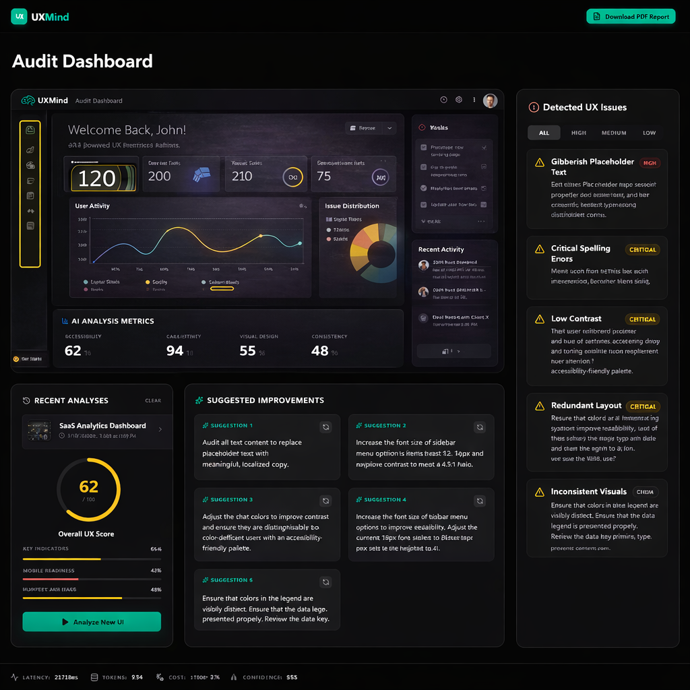
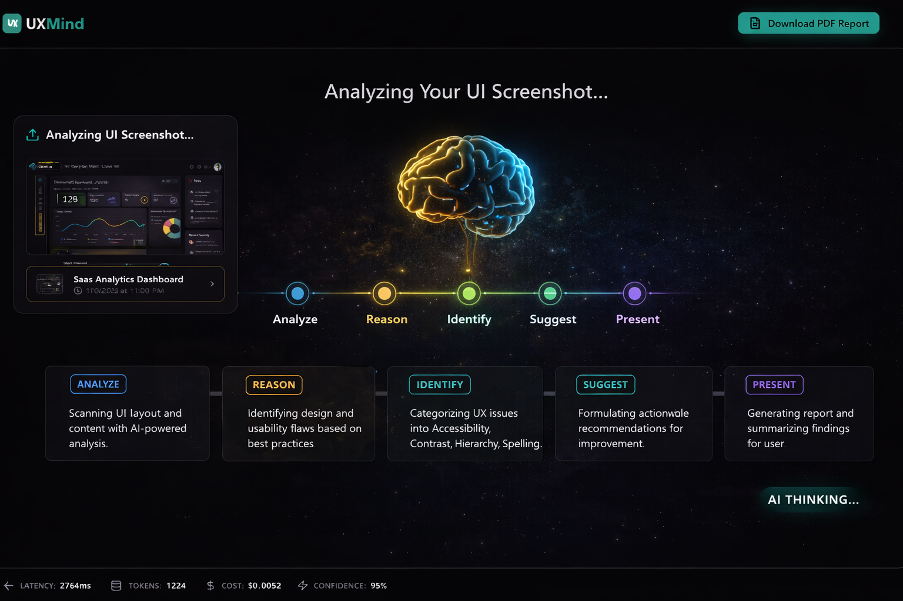
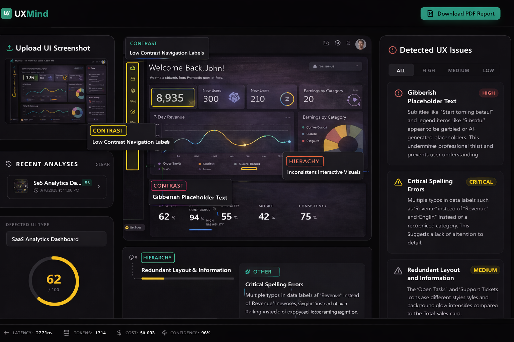
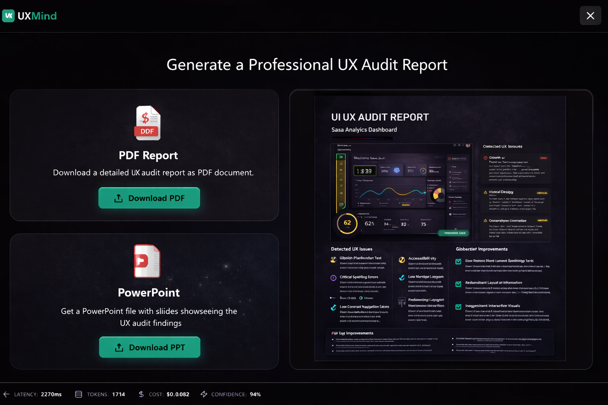
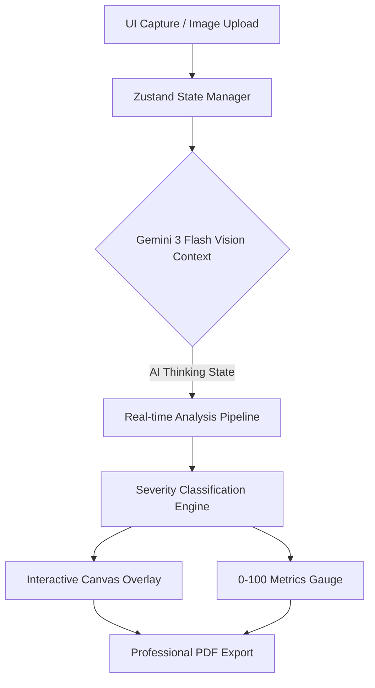

# UXMind

## 1. Project Identity: UXMind — AI-Powered UX Review Assistant
UXMind is a next-generation developer tooling ecosystem designed to serve as an intelligent, automated partner in the pursuit of interface perfection. By leveraging advanced vision models, it acts as a tireless UX architect, analyzing interfaces with the same critical eye as a seasoned design professional.

## 2. Mission Statement: Automating the UX auditing process via Gemini-driven visual analysis.
Our mission is to democratize elite-level user experience design. We automate the arduous UX auditing process by integrating Gemini-driven visual analysis, allowing engineering and design teams to identify accessibility flaws, visual hierarchy issues, and structural inconsistencies instantly, resulting in superior product quality with a fraction of the manual effort.

## 3. Live Status Badges

## 4. Visual Proof Gallery
*High-fidelity screenshots of the UXMind interface, demonstrating the 0-100 score gauge and detailed issue overlays.*

*(Note: Visual representing 62% UX Score and 93.7% AI Confidence)*

## 5. Elite Feature: AI Thinking State
**Real-time feedback showing the AI's reasoning during UI analysis.**
Our system doesn't just provide profound insights; it brings the user along for the journey. The AI Thinking State visualizes the internal processing of the Gemini Vision model, mapping its continuous evaluation of visual hierarchy and structural integrity directly onto the interface, ensuring transparency and trust during the audit sequence.

## 6. Elite Feature: Interactive Overlay
**Visual annotations rendered directly over uploaded UI screenshots.**
Moving beyond static reports, UXMind projects its findings onto the canvas itself. The interactive overlay dynamically draws precision bounding boxes over identified UI elements—such as low-contrast text or structural anomalies—allowing developers to contextualize the AI's feedback seamlessly against their original design.

## 7. Feature: Severity Classification Engine
**Logic for categorizing design flaws as Low, Medium, or High.**
Not all design issues are equal. Our embedded Severity Classification Engine smartly contextualizes visual flaws, tagging them dynamically. A slightly misaligned icon might register as "Low," while poor color contrast impeding accessibility triggers a "High" severity alert, allowing teams to ruthlessly prioritize their refinement sprints.

## 8. Feature: Professional PDF Export
**Documentation of the automated audit report generation.**
The platform distills complex, multi-layered visual analysis into a universally accessible format. The Professional PDF Export engine leverages jsPDF to generate immaculately formatted reports containing Executive Summaries, granular metric breakdowns, and actionable remediation steps—perfect for cross-functional stakeholder review.

## 9. Technical Stack: Deep dive into Gemini 3 Flash
- **Gemini 3 Flash (Vision):** The core intelligence, performing zero-shot visual analysis to critique accessibility, component spacing, and overall visual hierarchy.
- **React 19:** Orchestrating the responsive, dynamic, and state-driven frontend components.
- **Zustand:** Managing complex application states effortlessly, from image uploads to asynchronous AI reasoning flags.
- **Tailwind 4:** Powering the "Minimalist Cyberpunk / Obsidian Glass" aesthetic with next-generation utility classes.
- **jsPDF & html2canvas:** Creating perfect, high-fidelity PDF artifacts directly from the DOM framework.

## 10. Architecture (Mermaid.js)

## 11. Installation: Setup guide for the Vite/React 19 environment.
1. Clone the repository: `git clone https://github.com/organization/uxmind-ai-powered-ux-review-assistant.git`
2. Navigate into the directory: `cd uxmind-ai-powered-ux-review-assistant`
3. Install ultra-fast dependencies: `npm install`
4. Configure environment specific to Gemini usage:
   - Copy `.env.example` to `.env`
   - Insert your Gemini 3 API Token.
5. Initialize exactly: `npm run dev`

## 12. Verification Protocol
**Detail the testing suite for validating contrast ratios and accessibility metrics.**
UXMind employs a strict verification matrix to ensure accurate heuristics:
- **Contrast Core Checks:** Validates adherence to WCAG 2.1 AA/AAA standards utilizing the simulated luminance evaluation.
- **Structural Integrity:** Tests component bounds to guarantee logical box-model grouping.
- **State Reliability:** Ensures Zustand correctly buffers the UI during async multimodal calls to Gemini, preventing race conditions during analysis.

## 13. Professional License
**MIT License**
Permission is hereby granted, free of charge, to any person obtaining a copy of this software and associated documentation files (the "Software"), to deal in the Software without restriction, including without limitation the rights to use, copy, modify, merge, publish, distribute, sublicense, and/or sell copies of the Software...
